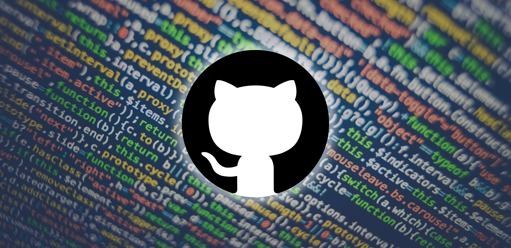

# 📚 My Amazon Books

| Linux for Rookies: 1st Edition | Linux para novatos: Edition 1 | Docker For Rookies: Edition 1 | Docker für Einsteiger: Ausgabe 1 |
| :---: | :---: | :---: | :---: |
|  |  |  |  
| [Buy on Amazon](https://www.amazon.com/dp/B0FPBM2RZ7) | [Buy on Amazon](https://www.amazon.com.br/dp/B0FPJVXF5Y) | [Buy on Amazon](https://www.amazon.com.br/dp/B0GJLR2N8L) | [Buy on Amazon](https://www.amazon.de/dp/B0GJNQPNY1) |

#### _Read this in [other languages](translations/Translations.md)._
<kbd></kbd>
<kbd></kbd>
<kbd></kbd>
<kbd></kbd>
<kbd></kbd>

|  |  |  |  |  |  |  |  |  |
| ------------------------------------------------------------ | ------------------------------------------------------------| ------------------------------------------------------------ | ---------------------------------------------------------------------- | -------------------------------------------------------------------- | ---------------------------------------------------------------- | -------------------------------------------------------------------- | --------------------------------------------------------------- | ------------------------------------------------------------ |
| [Dev Books](https://github.com/PhilipMello/eBooks)                     | [How-to](https://github.com/PhilipMello/how-to)  | [Media](https://github.com/PhilipMello/media)            | [Raspberry](https://github.com/PhilipMello/raspberrypi)                   | [Flipper Zero](https://github.com/PhilipMello/flipper0)                     | [Pi Hole](https://github.com/PhilipMello/pihole)                   | [gSwitch](https://github.com/PhilipMello/git-switch)               | [aaPanel](https://github.com/PhilipMello/aapanel)              | [Emoji](https://github.com/PhilipMello/emoji)              |

  

  

  

<h1 align="center">💡 SITES</h1>

  

---

  

---

<h1>💡 Projects</h1>

|  |  |  |  |  |
| ------------------------------------------------------------ | ------------------------------------------------------------| ------------------------------------------------------------ | ---------------------------------------------------------------------- | ---------------------------------------------------------------------- |
| [ktool](https://github.com/PhilipMello/kubernetes)                     | [gSwitch](https://github.com/PhilipMello/git-switch)  | [aaPanel](https://github.com/PhilipMello/aapanel)            | [Zorin](https://github.com/PhilipMello/zorin)                   | [Kubernetes From Scratch](https://github.com/PhilipMello/kubernetes-from-scratch)  |

  

<!--

<h1>💡 Projects</h1>

|  |  Projects |
|-----:|-----------|
| | [Kubernetes Tools (ktool)](https://github.com/PhilipMello/kubernetes) - 🔧 Azure Kubernetes Tools (AKS)|
| | [Git Account Switch (gswitch)](https://github.com/PhilipMello/git-switch) - 🔧 Git Account Switch (2 Accounts in 1 CLI)|
| | [Cloudflare (dnsflare)](https://github.com/PhilipMello/git-switch) - 🔧 dnsflare (DNS creation for cloudflare)|
| | [HOW-TO](https://github.com/PhilipMello/how-to) - 🔧 HOW-TO (Git,Github,Docker, Kubernetes,REGEX)|

# <a href="https://github.com/PhilipMello/kubernetes">
🔧 Azure Kubernetes Tools (AKS)
</a>

---

  
# <a href="https://github.com/PhilipMello/git-switch">
🔧 Git Account Switch (2 Accounts in 1 CLI)
</a>

     
 ---

  
# <a href="https://github.com/PhilipMello/cloudflare">
🔧  dnsflare (DNS creation for cloudflare)
</a>

---

  
# <a href="https://github.com/PhilipMello/how-to">
🔧  HOW-TO (Git,Github,Docker, Kubernetes,REGEX)
</a>

---

  
# <a href="https://github.com/AtomyCloud/docker-images">
🔨 Docker Container Images
</a>

-->
---

### 
Contributors

   

  

  
