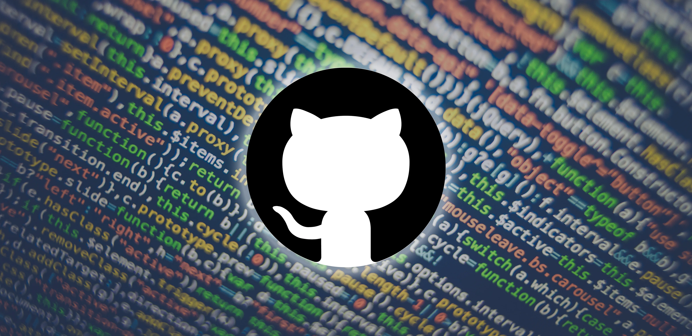

#### _Read this in [other languages](translations/Translations.md)._
<kbd></kbd>
<kbd></kbd>
<kbd></kbd>
<kbd></kbd>
<kbd></kbd>

|  |  |  |  |  |  |  |  |  |
| ------------------------------------------------------------ | ------------------------------------------------------------| ------------------------------------------------------------ | ---------------------------------------------------------------------- | -------------------------------------------------------------------- | ---------------------------------------------------------------- | -------------------------------------------------------------------- | --------------------------------------------------------------- | ------------------------------------------------------------ |
| [Dev Books](https://github.com/PhilipMello/eBooks)                     | [How-to](https://github.com/PhilipMello/how-to)  | [Media](https://github.com/PhilipMello/media)            | [Raspberry](https://github.com/PhilipMello/raspberrypi)                   | [Flipper Zero](https://github.com/PhilipMello/flipper-zero)                     | [Pi Hole](https://github.com/PhilipMello/pihole)                   | [gSwitch](https://github.com/PhilipMello/git-switch)               | [aaPanel](https://github.com/PhilipMello/aapanel)              | [Emoji](https://github.com/PhilipMello/emoji)              |

  

## 💖 Developer Donations

If you would like to support this project, you can donate using the following cryptocurrencies. Your contributions are greatly appreciated! 🙏

| Cryptocurrency | Address                        |
|----------------|--------------------------------|
|  (BTC)    | bc1qz29vpduvmhxmm507kx7ecruqtrvpklqms8sgr8 
|  (BCH)    | qpsa4wnudws5h3mzfz89eu5j4rwmw6l25shr6u40ys
|  (BNB)  | 0x7c66a7268F2ac9A690AF226E1eFEC6B3d530E3Cc 
|  (BEP20)    | 0x7c66a7268F2ac9A690AF226E1eFEC6B3d530E3Cc                           |
|  (ETH) | 0x7c66a7268F2ac9A690AF226E1eFEC6B3d530E3Cc                           |
|  (LTC) | ltc1q8mjxre3r7k79584737ndl73m2q0ejuxw7t98cn                           |
|  (ADA)   | addr1q9tdw6s2lewghhy7tlpw22ccv4qyfyjnjuf4grd92k46a5jh0jaszk30gqtl0nrgjanvuyhypsyrkmyyv6rhpx5jkz2sc9pfgm                           |
|  (TRX) | TFshh7vCHNN55DWwsHCNCnnf7czRcVEs5k                           |
|  (ZEC)| t1VP9XqQF8e1G69QcZyvy8octaXtn5g9Vj6
|  (RVN)|RSSvu9bz3qfNG5CRi92vvicjCJSasFC6Zo

> **Note**: If your don't have the keys, is not your money.

  

  

<!--

   
   
  
   

-->

<!--

  

<h1 align="center">💡 SITES</h1>

  <a href="https://infodica.com/">InfoDica - MarketPlace</a>
  <a href="https://clicke.me/">URL Shortener</a>
  <a href="https://phpl.ink/">URL Shortener</a>
  

---
-->

  

---
<!---->

<h1>💡 Projects</h1>

|  |  |  |  |
| ------------------------------------------------------------ | ------------------------------------------------------------| ------------------------------------------------------------ | ---------------------------------------------------------------------- |
| [ktool](https://github.com/PhilipMello/ktool)                     | [gSwitch](https://github.com/PhilipMello/git-switch)  | [aaPanel](https://github.com/PhilipMello/aapanel)            | [Zorin](https://github.com/PhilipMello/zorin)                   | 

  

<!--

<h1>💡 Projects</h1>

|  |  Projects |
|-----:|-----------|
| | [Kubernetes Tools (ktool)](https://github.com/PhilipMello/kubernetes) - 🔧 Azure Kubernetes Tools (AKS)|
| | [Git Account Switch (gswitch)](https://github.com/PhilipMello/git-switch) - 🔧 Git Account Switch (2 Accounts in 1 CLI)|
| | [Cloudflare (dnsflare)](https://github.com/PhilipMello/git-switch) - 🔧 dnsflare (DNS creation for cloudflare)|
| | [HOW-TO](https://github.com/PhilipMello/how-to) - 🔧 HOW-TO (Git,Github,Docker, Kubernetes,REGEX)|

# <a href="https://github.com/PhilipMello/kubernetes">
🔧 Azure Kubernetes Tools (AKS)
</a>

---

  
# <a href="https://github.com/PhilipMello/git-switch">
🔧 Git Account Switch (2 Accounts in 1 CLI)
</a>

     
 ---

  
# <a href="https://github.com/PhilipMello/cloudflare">
🔧  dnsflare (DNS creation for cloudflare)
</a>

---

  
# <a href="https://github.com/PhilipMello/how-to">
🔧  HOW-TO (Git,Github,Docker, Kubernetes,REGEX)
</a>

---

  
# <a href="https://github.com/AtomyCloud/docker-images">
🔨 Docker Container Images
</a>

-->
---

### 
Contributors

   

  

  
